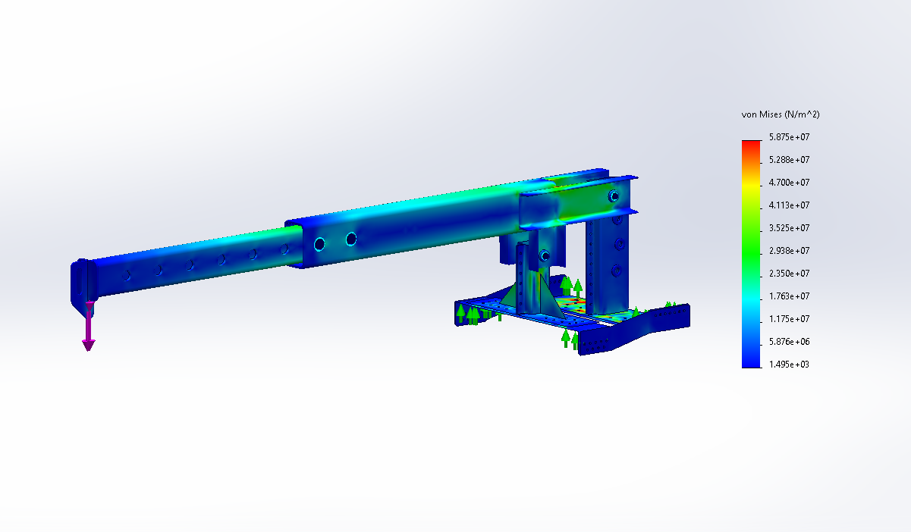

# Telescopic Jib Crane for a 3-Ton Forklift

A SolidWorks design study for a bolt-on telescopic jib crane attachment. The concept targets a **1.5-ton design load**, adjustable reach and a practical welded-steel construction for a 3-ton forklift.

> This is an engineering design study. The FEA values below depend on the stated assumptions and are not a certification for lifting operation.

## Design brief

- Forklift-mounted lifting attachment
- 1.5-ton design load
- Telescopic boom with 100 mm extension steps
- Adjustable tilt from 0° to 45°
- Maximum modeled reach: 2.5 m
- Bolt-on mounting structure
- Manufacturing-oriented geometry

## Workflow

1. Translate the lifting, reach and mounting requirements into a mechanical concept.
2. Build the complete assembly and parts in SolidWorks 2024.
3. Produce engineering drawings and review the assembly for fabrication and maintenance.
4. Run a static structural study in SolidWorks Simulation.
5. Review stress, displacement and the practical load path.

## CAD assembly

The assembly includes the telescopic boom, fork mounting structure, pivot mechanism, reinforcement plates and bolted connections.

## Structural study

The study uses the following idealized assumptions:

- Fixed support at the forklift fork-mounting region
- Vertical lifting load at the boom tip
- Linear-elastic material behavior
- Assumed ST52 structural steel properties

### Stress

The reported maximum von Mises stress is **58.75 MPa**. Under the assumed ST52 material model, this corresponds to an approximate safety factor of **6**.

### Displacement

The reported maximum displacement is **9.97 mm** under the considered loading condition.

## Repository structure

- `SOLIDWORKS/` — parts and assemblies
- `Drawing/` — engineering drawings
- `Simulation/` — simulation screenshots and animation
- `renders/` — rendered views
- `video/` — assembly and mechanism animations
- `images/` — README figures

## Tools

SolidWorks 2024 · SolidWorks Simulation · CAD assembly · Mechanical design · FEA · Engineering documentation
